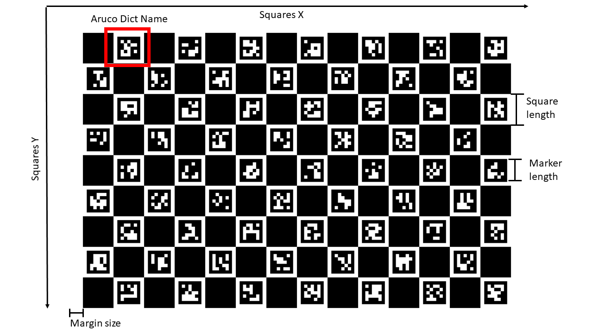
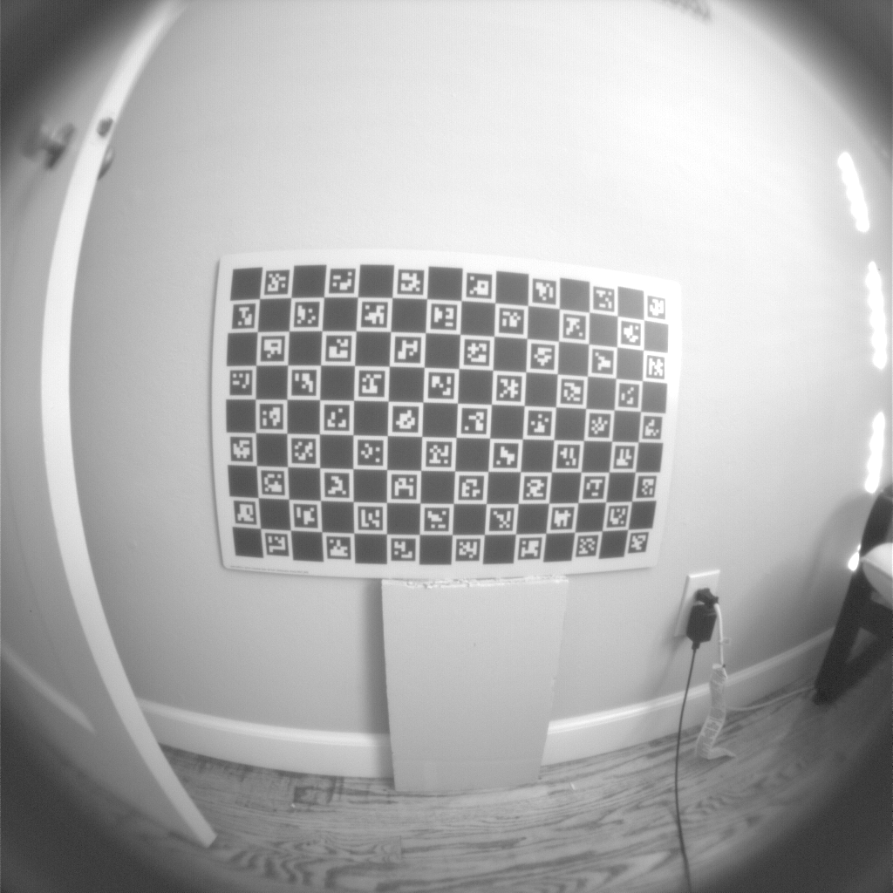
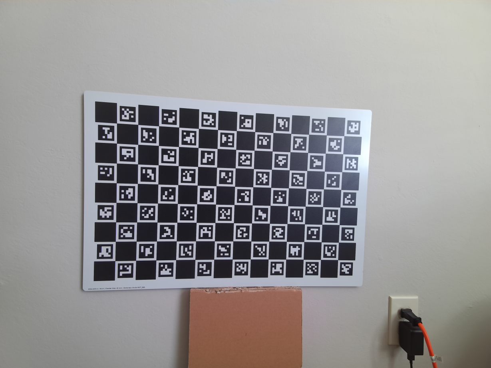

# Azure Kinect - Depth Evaluation Tools Examples

## Description

   Depth Evaluation Example Tools for K4A.

   These tools enable developers to collect depth and color images from a Azure Kinect device `collect`, evaluate the depth bias `depth_eval`, evaluate the transformation between sensors `transformation_eval`, and convert mkv files to images `mkv2images`.

---
## Setup

   1. Print out either the large or the small target provided in the repo: `plane_files\plane_large.pdf` or `plane_files\plane_small.pdf`.
   2. `plane_large.json` and `plane_small.json` define the physical parameters of the board. Square length is the length of one side in mm of the charuco_square, marker_length is the size length of the QR code marker in mm. Modify these parameters in the json based on the dimensions of the board printed.
        * Parameter aruco_dict_name is an ENUM specifying the tag type. The one used in the above example is #6
        * See predefined dictionaries at [OpenCV](https://docs.opencv.org/master/dc/df7/dictionary_8hpp.html)
         
   3. To capture good data, it is recommended to capture images of the target board with the camera(s) aligned with the center of the target and from a reasonable distance such that the target board fills the majority of the view. See the provided example data for reference.
   4. For high quality data, the image should _not_ be grainy and you should be able to visually see all fiducial features on the board.
       * The majority of the tools take a MKV file as an input. A good way to capture data is to use the Azure Kinect DK recorder. Example command: ```k4arecorder.exe -c 3072p -d PASSIVE_IR -l 5  board1.mkv```
       * Good example: The fiducial lines are clear and distinct even to the human eye.
       * To verify the collected data is of high quality, use the `mkv2images` tool to view the data collected.
        
		
---
## Using the `collect` Tool to Capture Images

   1. This tool is used to collect color, passive IR, and/or depth images from the device.
   2. Based on the number of view specified (-nv), this tool will pause after each capture to allow the user to move the device to the next position.
   3. This tool is a good aid for collecting images for use with the Calibration and Registration tools. 
   5. Minimum example command: ```./collect  -mode=3 -res=1 -nv=2 -nc=10 -cal=1 -out=c:/data```
   4. The following are all the options exposed by this tool, see tool specific README for more information:
   
   ```
   ./collect -h or -help or -? print the help message
   ./collect -mode=<depth mode> -nv=<num of views> -nc=<num of captures per view> -fps=<frame rate enum>
   -cal=<dump cal file> -xy=<dump xytable> -d=<capture depth> -i=<capture ir> -c=<capture color>
   -out=<output directory>
   -gg=<gray_gamma used to convert ir data to 8bit gray image. default=0.5>
   -gm=<gray_max used to convert ir data to 8bit gray image. default=4000.0>
   -gp=<percentile used to convert ir data to 8bit gray image. default=99.0>
   -av=<0:dump mean images only, 1:dump all images, 2:dump all images and their mean>
   ```
---
## Using the `mkv2images` Tool to Convert MKV captures to Images

   1. This tool is used to dump png images from a provided MKV file.
   2. This tool should be used to verify that the collected mkv data is of high enough quality as mentioned in the setup section.
   3. It is recomended that MKV files are collected using the Azure Kinect DK recorder. Example command: ```k4arecorder.exe -c 3072p -d PASSIVE_IR -l 5  board1.mkv```
   4. Minimum example command: ```./mkv2images -in=board1.mkv -out=c:/data -c=0 -f=0```
   4. The following are all the options exposed by this tool, see tool specific README for more information:

   ```
   ./mkv2images -h or -help or -? print the help message
   ./mkv2images -in=<input mkv file> -out=<output directory> -d=<dump depth> -i=<dump ir> -c=<dump color>
   -f=<0:dump mean images only, 1 : dump first frame>
   -gg=<gray_gamma used to convert ir data to 8bit gray image. default=0.5>
   -gm=<gray_max used to convert ir data to 8bit gray image. default=4000.0>
   -gp=<percentile used to convert ir data to 8bit gray image. default=99.0>
   ```
---
## Using the `depth_eval` Tool to Evaluate Depth Bias

   1. This tool is used to evaluate the depth bias of a device. 
   2. This tool requires two MKV files as input, one captured using PASSIVE_IR and the other using WFOV_2X2BINNED. These two files should be collected with the camera and target board setup unchanged.
   3. The Passive IR MKV file should be collected using the following command: ```k4arecorder.exe -c 3072p -d PASSIVE_IR -l 3  board1.mkv```
   4. The Depth MKV file should be collected using the following command: ```k4arecorder.exe -c 3072p -d WFOV_2X2BINNED -l 3 board2.mkv```
   5. This tool will evaluate the depth bias of the device and output the results to the console.
   6. The output consists of four values. Total charuco corners as specified by the charuco dictionary, the actual number of detected corners (Depends on image quality, the higher the better), the Mean Z depth bias in millimeters, and the RMS Z depth bias in millimeters. 
   7. Depth bias is the difference between the ground truth depth measurement (determined by the projection of the target board) and the measured depth from the sensor. 
   8. Example Output:
   
   ```
   board has 104 charuco corners
   number of detected corners in ir = 73
   Mean of Z deph bias = 18.6551 mm
   RMS of Z depth bias = 18.7039 mm
   ```

   9. Minimum example command: ```./depth_eval -i=board1.mkv -d=board2.mkv -t=plane.json -out=c:/data```
   10. The following are all the options exposed by this tool, see tool specific README for more information:

   ```
   ./depth_eval -h or -help or -? print the help message
   ./depth_eval -i=<passive_ir mkv file> -d=<depth mkv file> -t=<board json template>
   -out=<output directory> -s=<1:generate and save result images>
   -gg=<gray_gamma used to convert ir data to 8bit gray image. default=0.5>
   -gm=<gray_max used to convert ir data to 8bit gray image. default=4000.0>
   -gp=<percentile used to convert ir data to 8bit gray image. default=99.0>
   ```
---
## Using the `transformation_eval` Tool to Evaluate Transformation Mapping Between Sensors

   1. This tool is used to evaluate the transformation between the sensors of a single device. 
   2. This tool requires two MKV files as input, one captured using PASSIVE_IR and the other using WFOV_2X2BINNED. These two files should be collected with the camera and target board setup unchanged.
   3. The Passive IR MKV file should be collected using the following command: ```k4arecorder.exe -c 3072p -d PASSIVE_IR -l 3  board1.mkv```
   4. The Depth MKV file should be collected using the following command: ```k4arecorder.exe -c 3072p -d WFOV_2X2BINNED -l 3 board2.mkv```
   5. This tool will evaluate the transformation re-projection error between the color camera and depth sensor of a device. 
   6. The output consists of five values. Total charuco corners as specified by the charuco dictionary, the actual number of detected corners in IR capture (Depends on image quality, the higher the better), the actual number of detected corners in the color capture (Depends on image quality, the higher the better), the number of common corners detected between the images, and the RMS re-projection error in pixles.
   7. Re-projection error is the difference between the position of the target in the color image and the target as captured in the IR image projected into the coordinate space of the color camera. 

   ```
     Sensor B          Sensor A (prj)
   ------------        ------------
   | 3D points| -----> | 3D points|
   ------------        ------------
        ^                   |
        |                   |
        |                   v                    Sensor A (detected)
   ------------        ------------   diff with  ------------
   | 3D board |        | 2D points|  <---------> | 2D points|
   ------------        ------------              ------------
   ```
   
   8. Example Output:

   ```
   board has 104 charuco corners
   corners detected in ir = 73
   corners detected in color = 93
   number of common corners = 65
   rms = 7.42723 pixels
   ```

   9. Minimum example command: ```./transformation_eval -i=board1.mkv -d=board2.mkv -t=plane.json -out=c:/data```
   10. The following are all the options exposed by this tool, see tool specific README for more information:
   
   ```
   ./transformation_eval -h or -help or -? print the help message
   ./transformation_eval -i=<passive_ir mkv file> -d=<depth mkv file> -t=<board json template>
   -out=<output directory> -s=<1:generate and save result images>
   -gg=<gray_gamma used to convert ir data to 8bit gray image. default=0.5>
   -gm=<gray_max used to convert ir data to 8bit gray image. default=4000.0>
   -gp=<percentile used to convert ir data to 8bit gray image. default=99.0>
   ```
---
## OpenCV Dependency 

   These example tools require both OpenCV and OpenCV Contrib to be installed. 

   To build opencv and opencv_contrib from source follow these steps:

   [General Instalation Toutorial](https://docs.opencv.org/4.5.0/d0/d3d/tutorial_general_install.html)

   [OpenCV configuration options](https://docs.opencv.org/master/db/d05/tutorial_config_reference.html)

   1. Start an instance of "x64 Native Tools Command Prompt for VS 2019" 

   2. Clone opencv and opencv_contrib:

      ```c:\> git clone https://github.com/opencv/opencv && git -C opencv checkout 4.5.0```

      ```c:\> git clone https://github.com/opencv/opencv_contrib && git -C opencv_contrib checkout 4.5.0```

   3. Build Release Version

      ```c:\> cd opencv && mkdir build && cd build```

      ```c:\opencv\build> cmake .. -GNinja -DOPENCV_EXTRA_MODULES_PATH=../../opencv_contrib/modules -DBUILD_opencv_world=ON -DCMAKE_BUILD_TYPE=Release -DBUILD_PERF_TESTS:BOOL=OFF -DBUILD_TESTS:BOOL=OFF -DCMAKE_INSTALL_PREFIX=c:/opencv/build```

   4. Install Release Version

      ```c:\opencv\build> cd ..```
      ```c:\opencv> cmake --build c:/opencv/build --target install```

   5. Build Debug Version

      ```c:>mkdir build_debug && cd build_debug```

      ```c:\opencv\build_debug>cmake .. -GNinja -DOPENCV_EXTRA_MODULES_PATH=../../opencv_contrib/modules -DBUILD_opencv_world=ON -DCMAKE_BUILD_TYPE=Debug -DBUILD_PERF_TESTS:BOOL=OFF -DBUILD_TESTS:BOOL=OFF -DCMAKE_INSTALL_PREFIX=c:/opencv/build```

   6. Install Debug Version

      ```c:\opencv\build_debug> cd ..```

      ```c:\opencv> cmake --build c:/opencv/build_debug --target install```


   ***NOTE*** 

   The default install location for opencv is `c:\opencv\build\install\...`
   
   However the Azure-Kinect-Sensor-SDK expects an install at `c:\opencv\build\...`

   To change the default install location add `-DCMAKE_INSTALL_PREFIX=<path_of_the_new_location>`
   to the `cmake .. -GNinja` command 

